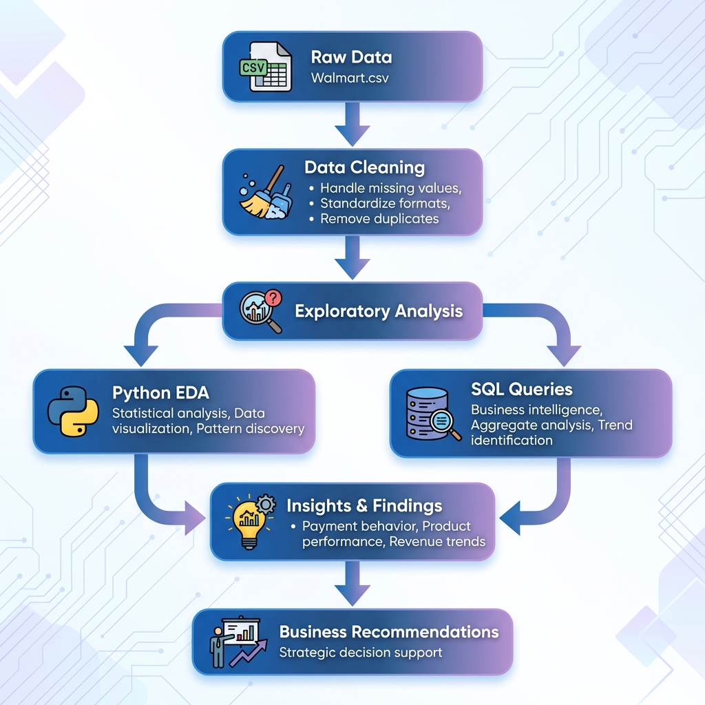
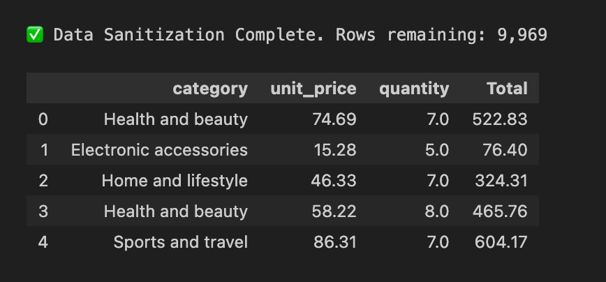
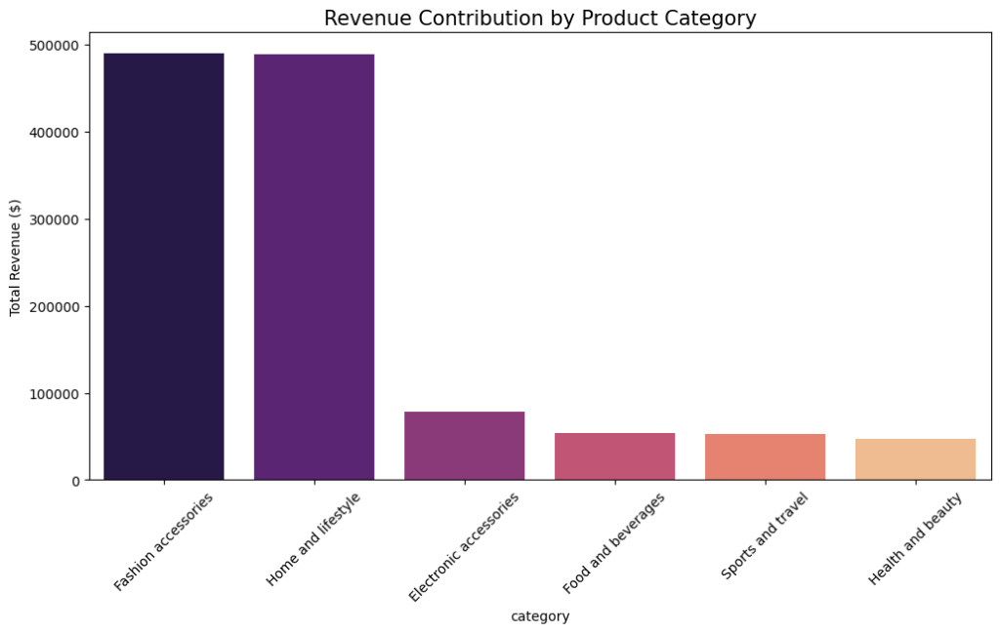

<a id="readme-top"></a>

<!-- PROJECT LOGO -->
<br />
<div align="center">
  <h3 align="center">Walmart Sales Exploratory Data Analysis (EDA)</h3>

  <p align="center">
    An in-depth EDA project leveraging Python and SQL to explore Walmart transaction data and extract actionable business insights.
    <br />
    <a href="https://github.com/prgyakapur/walmart-exploratory-data-analysis"><strong>Explore the docs »</strong></a>
    <br />
    <br />
    <a href="https://github.com/prgyakapur/walmart-exploratory-data-analysis/issues">Report Bug</a>
    ·
    <a href="https://github.com/prgyakapur/walmart-exploratory-data-analysis/issues">Request Feature</a>
  </p>
</div>

<!-- TABLE OF CONTENTS -->
<details>
  <summary>Table of Contents</summary>
  <ol>
    <li>
      <a href="#about-the-project">About The Project</a>
      <ul>
        <li><a href="#analysis-workflow">Analysis Workflow</a></li>
        <li><a href="#sample-outputs">Sample Outputs</a></li>
        <li><a href="#built-with">Built With</a></li>
      </ul>
    </li>
    <li>
      <a href="#getting-started">Getting Started</a>
      <ul>
        <li><a href="#prerequisites">Prerequisites</a></li>
        <li><a href="#installation">Installation</a></li>
      </ul>
    </li>
    <li><a href="#usage">Usage</a></li>
    <li><a href="#key-insights">Key Insights</a></li>
    <li><a href="#roadmap">Roadmap</a></li>
    <li><a href="#contact">Contact</a></li>
    <li><a href="#acknowledgments">Acknowledgments</a></li>
  </ol>
</details>

<!-- ABOUT THE PROJECT -->
## About The Project

This project demonstrates end-to-end **Exploratory Data Analysis (EDA)** of Walmart retail transactions, showcasing proficiency in data cleaning, statistical analysis, data visualization, SQL querying, and deriving business insights. The analysis explores and identifies critical patterns in customer behavior, payment preferences, product performance, and operational efficiency to support strategic decision-making.

**Key Business Questions Addressed:**
* Which payment methods drive the most transactions and units sold?
* What are the peak business hours and days for optimal staffing?
* Which product categories generate the highest profit margins?
* How do customer ratings vary across cities and product categories?
* What revenue trends exist year-over-year (2022 vs 2023)?

The project includes comprehensive **Python-based EDA** with statistical summaries, data visualizations, and SQL queries designed to explore data patterns and solve real-world retail business problems.

### Analysis Workflow

The following diagram illustrates the end-to-end analytical process:

<div align="center">
  
</div>

### Sample Outputs

#### Data Cleaning & Transformation
Successfully sanitized 9,969 transaction records, handling missing values and standardizing data formats:

<div align="center">
  
</div>

#### Revenue Analysis by Category
Visualization revealing **Fashion Accessories** and **Home and Lifestyle** as top revenue-generating categories:

<div align="center">
  
</div>

<p align="right">(<a href="#readme-top">back to top</a>)</p>


### Built With

* [![Python][Python.org]][Python-url]
* [![Pandas][Pandas-badge]][Pandas-url]
* [![MySQL][MySQL-badge]][MySQL-url]
* [![Jupyter][Jupyter-badge]][Jupyter-url]

<p align="right">(<a href="#readme-top">back to top</a>)</p>

<!-- GETTING STARTED -->
## Getting Started

Follow these instructions to set up the project locally.

### Prerequisites

* Python 3.x
* MySQL Server
* Jupyter Notebook
  ```sh
  pip install jupyter
  ```

### Installation

1. Clone the repo
   ```sh
   git clone https://github.com/prgyakapur/walmart-exploratory-data-analysis.git
   ```
2. Install Python packages
   ```sh
   pip install -r requirements.txt
   ```
3. Set up MySQL database
   ```sql
   CREATE DATABASE walmart_db;
   ```
4. Import the cleaned data into MySQL or use the provided SQL script

<p align="right">(<a href="#readme-top">back to top</a>)</p>

<!-- USAGE EXAMPLES -->
## Usage

### Python Analysis
Open and run the Jupyter notebook to explore the data cleaning process and visualizations:
```sh
jupyter notebook walmart.ipynb
```

### SQL Analysis
Execute the SQL queries to perform business intelligence analysis:
```sh
mysql -u root -p walmart_db < walmart_sql_eda.sql
```

**Sample Analysis Workflow:**
1. **Data Cleaning**: Remove missing values, standardize formats, create derived features
2. **Statistical Analysis**: Analyze distributions and patterns in numerical variables (quantity, price, total revenue)
3. **SQL Queries**: Execute 9 strategic queries covering payment analytics, category performance, profitability, and revenue trends
4. **Business Insights**: Generate actionable recommendations based on data findings

<p align="right">(<a href="#readme-top">back to top</a>)</p>

<!-- KEY INSIGHTS -->
## Key Insights

### 📊 Statistical Analysis
The exploratory analysis revealed key patterns:
* Strong relationship between quantity purchased and total revenue
* Unit price variations across different product categories
* Customer ratings distributed independently of purchase amounts

### 💳 Payment Behavior
* Identified the most popular payment methods across branches
* Found regional preferences to optimize checkout infrastructure and digital promotions

### 📦 Product Performance
* Electronic Accessories and Food & Beverages showed strong performance
* Certain categories demonstrated higher profit margins despite lower transaction volumes

### ⏰ Operational Efficiency
* Afternoon shifts consistently showed the highest transaction volumes
* Peak days varied by branch, enabling customized staffing strategies

### 📉 Revenue Trends
* Detected year-over-year revenue decline in specific branches (2022 vs 2023)
* Enabled targeted intervention strategies for underperforming locations

<p align="right">(<a href="#readme-top">back to top</a>)</p>

<!-- ROADMAP -->
## Roadmap

- [x] Complete data cleaning and transformation
- [x] Perform exploratory data analysis (EDA)
- [x] Execute SQL business intelligence queries
- [x] Generate data visualizations
- [ ] Implement predictive modeling for sales forecasting
- [ ] Add customer segmentation using clustering algorithms
- [ ] Create interactive dashboards with Tableau/Power BI
- [ ] Perform time-series analysis for seasonal trends

<p align="right">(<a href="#readme-top">back to top</a>)</p>

<!-- CONTACT -->
## Contact

Prgya Kapur

Project Link: [https://github.com/prgyakapur/walmart-exploratory-data-analysis](https://github.com/prgyakapur/walmart-exploratory-data-analysis)

<p align="right">(<a href="#readme-top">back to top</a>)</p>

<!-- ACKNOWLEDGMENTS -->
## Acknowledgments

* Dataset: Walmart retail transaction data
* Analysis Tools: Python, MySQL, Jupyter Notebook
* Visualization Libraries: Matplotlib, Seaborn
* Inspiration: Real-world retail business intelligence challenges

<p align="right">(<a href="#readme-top">back to top</a>)</p>

<!-- MARKDOWN LINKS & IMAGES -->
[Python.org]: https://img.shields.io/badge/Python-3776AB?style=for-the-badge&logo=python&logoColor=white
[Python-url]: https://www.python.org/
[Pandas-badge]: https://img.shields.io/badge/Pandas-150458?style=for-the-badge&logo=pandas&logoColor=white
[Pandas-url]: https://pandas.pydata.org/
[MySQL-badge]: https://img.shields.io/badge/MySQL-4479A1?style=for-the-badge&logo=mysql&logoColor=white
[MySQL-url]: https://www.mysql.com/
[Jupyter-badge]: https://img.shields.io/badge/Jupyter-F37626?style=for-the-badge&logo=jupyter&logoColor=white
[Jupyter-url]: https://jupyter.org/
